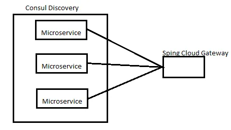
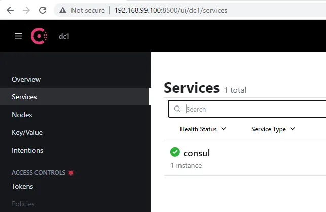
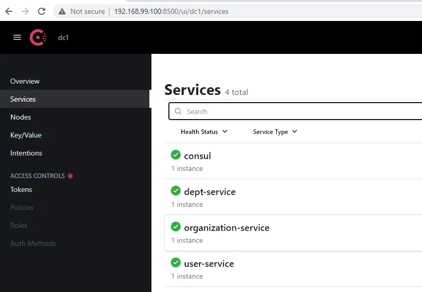
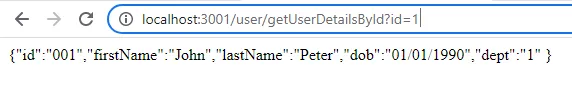
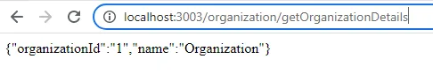
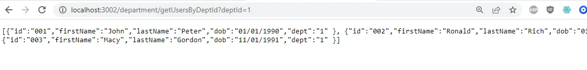
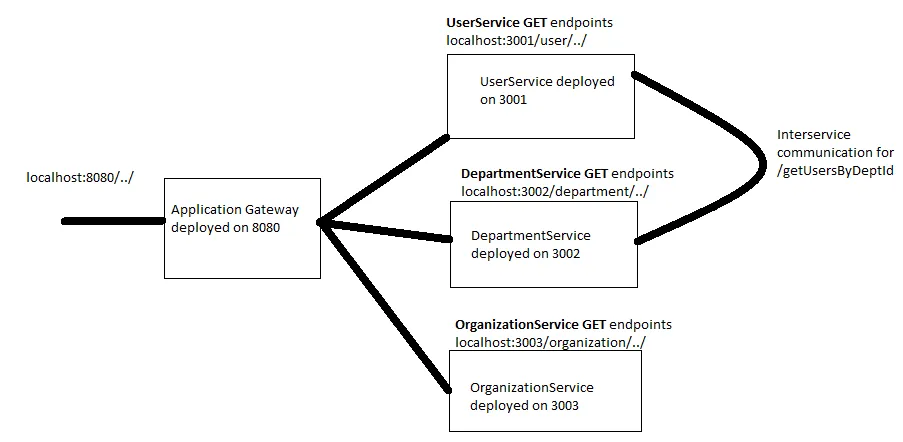
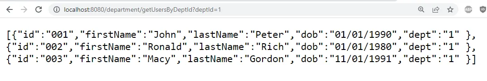
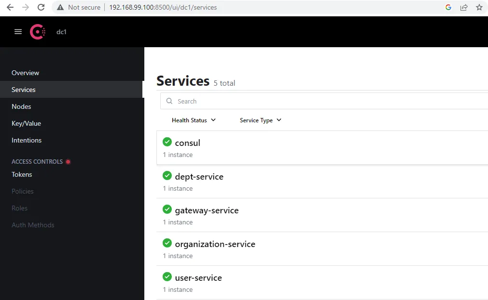
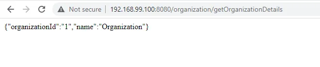

Spring Boot Microservices with Consul, Spring Cloud Gateway and Docker
====================================
> Source: https://blog.devops.dev/spring-boot-microservices-with-consul-spring-cloud-gateway-and-docker-789b624d1d32

Microservices are now the norm when building service applications and Spring Boot is a common platform used. In this article we will do the following:

*   Build 3 small **Spring Boot Service** applications, which will be the three microservices
*   Use **Consul** for **service discovery**
*   Create a **Spring Cloud Gateway** application which will work with Consul to be the microservices gateway
*   Run the whole architecture on **Docker**
*   Create a single **Docker compose** file to build and deploy everything together

The 3 individual microservices applications will be using **Consul** discovery and exposed to the outside world behind a Spring Cloud Gateway. Consul ([https://developer.hashicorp.com/consul/docs/intro](https://developer.hashicorp.com/consul/docs/intro)) is a services identity and networking solution, which we will use for service discovery and orchestration.

Setting up HashiCorp Consul
===========================

Consul is a distributed service discovery and configuration system ([https://developer.hashicorp.com/consul/docs/intro](https://developer.hashicorp.com/consul/docs/intro)). We will use Consul as our service discovery and orchestration solution. Another service discovery solution I have used before is Eureka, but unlike Eureka, Consul is non-blocking, newer and more efficient. Spring has a consul integration called Spring Cloud Consul, which we will use in the microservices to allow consul to discover them. Please refer to the Consul documentation on service discovery here: [https://developer.hashicorp.com/consul/docs/concepts/service-discovery](https://developer.hashicorp.com/consul/docs/concepts/service-discovery).

We will use Docker to setup a local Consul cluster ([https://hub.docker.com/\_/consul](https://hub.docker.com/_/consul)).

**PLEASE NOTE:** The following instructions for Consul Docker setup are done on a Windows 10 machine and will probably be different on a different OS. Please refer to the official Consul documentation on docker hub for more information ([https://hub.docker.com/\_/consul](https://hub.docker.com/_/consul)). You could also download consul.exe from the official website and run a cluster directly instead of using Docker.

In a production environment, you would have Consul server(s) and multiple client agents in multiple nodes to form a highly available Consul cluster. But for this demo, we will create a single node server agent.

First of all, get the docker machine IP by executing:

> $ docker-machine ip  
> **_192.168.99.100_**

Now create a Consul server from the latest docker consul image.

> $ docker run -d — name=consul-server -p 8500:8500 consul agent -server -bootstrap-expect=1 -ui -bind=0.0.0.0 -client=0  
> .0.0.0

After executing the command and verifying the container is running, navigate to the following url on a browser: [**http://192.168.99.100:8500/**](http://192.168.99.100:8500/) that should open up the Consul UI:

This should show the Consul server instance

So with this, we have the Consul Server up and running. We will now hookup 3 microservices to it.

The 3 Microservices Applications
================================

Lets first begin by building 3 simple microservice applications which will be wired to be discovered by **Consul**.

**User Service:**
-----------------

A simple User service that has two simple REST calls and runs on port **3001\.** For the Demo, the services will return hard coded String values.

/getUserDetailsById

/getUsersByDeptId

**pom.xml**

<project xmlns="http://maven.apache.org/POM/4.0.0" xmlns:xsi="http://www.w3.org/2001/XMLSchema-instance" xsi:schemaLocation="http://maven.apache.org/POM/4.0.0 https://maven.apache.org/xsd/maven-4.0.0.xsd">  
  <modelVersion>4.0.0</modelVersion>  
  <parent>  
   <groupId>org.springframework.boot</groupId>  
   <artifactId>spring-boot-starter-parent</artifactId>  
   <version>2.7.1</version>  
   <relativePath/>  
  </parent>  
  <groupId>com.demo.microservices</groupId>  
  <artifactId>userservice</artifactId>  
  <version>0.0.1-SNAPSHOT</version>  
  <name>UserService</name>    
  <dependencyManagement>  
   <dependencies>  
      <dependency>  
         <groupId>org.springframework.cloud</groupId>  
         <artifactId>spring-cloud-dependencies</artifactId>  
         <version>2021.0.1</version>  
         <type>pom</type>  
         <scope>import</scope>  
      </dependency>  
   </dependencies>  
</dependencyManagement>    
  <dependencies>  
   <dependency>  
      <groupId>org.springframework.cloud</groupId>  
      <artifactId>spring-cloud-starter-consul-all</artifactId>  
   </dependency>  
   <dependency>  
      <groupId>org.springframework.boot</groupId>  
      <artifactId>spring-boot-starter-web</artifactId>  
   </dependency>  
   <dependency>  
      <groupId>org.springframework.boot</groupId>  
      <artifactId>spring-boot-starter-actuator</artifactId>  
   </dependency>  
</dependencies>  
<build>  
  <plugins>  
   <plugin>  
    <groupId>org.springframework.boot</groupId>  
    <artifactId>spring-boot-maven-plugin</artifactId>  
   </plugin>  
  </plugins>  
 </build>  
</project>

**UserServiceApplication.java**

package com.demo.microservices.userservice;import org.springframework.boot.SpringApplication;  
import org.springframework.boot.autoconfigure.SpringBootApplication;  
import org.springframework.cloud.client.discovery.EnableDiscoveryClient;@SpringBootApplication  
@EnableDiscoveryClient  
public class UserServiceApplication {  
   
 public static void main(String\[\] args) {  
  SpringApplication.run(UserServiceApplication.class, args);  
 }  
}

Here we use the @EnableDiscoveryClient to allow the Consul discovery service to find this service when deployed.

**UserServiceController.java**

package com.demo.microservices.userservice;import org.springframework.http.HttpStatus;  
import org.springframework.http.ResponseEntity;  
import org.springframework.web.bind.annotation.GetMapping;  
import org.springframework.web.bind.annotation.RequestMapping;  
import org.springframework.web.bind.annotation.RequestParam;  
import org.springframework.web.bind.annotation.RestController;@RestController  
@RequestMapping("/user")  
public class UserServiceController {  
   
 @GetMapping("/getUserDetailsById")  
 public ResponseEntity<String> getUserDetailsById(@RequestParam String id){  
  String returnObject ="{\\"id\\":\\"001\\",\\"firstName\\":\\"John\\",\\"lastName\\":\\"Peter\\",\\"dob\\":\\"01/01/1990\\",\\"dept\\":\\"1\\" }";  
    
  return new ResponseEntity<String>(returnObject,HttpStatus.OK);    
 }  
   
 @GetMapping("/getUsersByDeptId")  
 public ResponseEntity<String> getUsersByDeptId(@RequestParam String deptId){  
  String returnObject ="\[{\\"id\\":\\"001\\",\\"firstName\\":\\"John\\",\\"lastName\\":\\"Peter\\",\\"dob\\":\\"01/01/1990\\",\\"dept\\":\\"1\\" },"  
         + " {\\"id\\":\\"002\\",\\"firstName\\":\\"Ronald\\",\\"lastName\\":\\"Rich\\",\\"dob\\":\\"01/01/1980\\",\\"dept\\":\\"1\\" },"  
         + " {\\"id\\":\\"003\\",\\"firstName\\":\\"Macy\\",\\"lastName\\":\\"Gordon\\",\\"dob\\":\\"11/01/1991\\",\\"dept\\":\\"1\\" }\]";  
    
  return new ResponseEntity<String>(returnObject,HttpStatus.OK);    
 }  
}

A very basic REST service that exposes two endpoints and returns hard coded data.

**application.properties** (call me old fashioned for not using yml :). yml files are too big to use in articles, property files are more compact)

spring.application.name=user-service  
server.port=3001  
spring.cloud.consul.discovery.instanceId=${spring.application.name}-${server.port}-${random.int\[1,99\]}  
spring.cloud.consul.host=192.168.99.100  
spring.cloud.consul.port=8500  
spring.cloud.consul.discovery.prefer-ip-address=true  
spring.cloud.consul.config.enabled=false

Here, we describe a few consul properties:

spring.cloud.consul.host and port specifies the consul agent host and port. spring.cloud.consul.discovery.instanceId is the unique identifier for this service. spring.cloud.consul.discovery.prefer-ip-address tells the system to use IP rather than host name for discovery.

We will create two other services similar to this.

**Department Service:**
-----------------------

Runs on port **3002** and exposes two endpoints:

/getDepartmentDetailsById

/getDepartmentUsers

**pom.xml**

<project xmlns="http://maven.apache.org/POM/4.0.0" xmlns:xsi="http://www.w3.org/2001/XMLSchema-instance" xsi:schemaLocation="http://maven.apache.org/POM/4.0.0 https://maven.apache.org/xsd/maven-4.0.0.xsd">  
  <modelVersion>4.0.0</modelVersion>  
  <parent>  
   <groupId>org.springframework.boot</groupId>  
   <artifactId>spring-boot-starter-parent</artifactId>  
   <version>2.7.1</version>  
   <relativePath/>  
  </parent>  
  <groupId>com.demo.microservices</groupId>  
  <artifactId>deptservice</artifactId>  
  <version>0.0.1-SNAPSHOT</version>  
  <name>DeptService</name>    
  <dependencyManagement>  
   <dependencies>  
      <dependency>  
         <groupId>org.springframework.cloud</groupId>  
         <artifactId>spring-cloud-dependencies</artifactId>  
         <version>2021.0.1</version>  
         <type>pom</type>  
         <scope>import</scope>  
      </dependency>  
   </dependencies>  
</dependencyManagement>    
  <dependencies>  
   <dependency>  
      <groupId>org.springframework.cloud</groupId>  
      <artifactId>spring-cloud-starter-consul-all</artifactId>  
   </dependency>  
   <dependency>  
      <groupId>org.springframework.boot</groupId>  
      <artifactId>spring-boot-starter-web</artifactId>  
   </dependency>  
   <dependency>  
      <groupId>org.springframework.boot</groupId>  
      <artifactId>spring-boot-starter-actuator</artifactId>  
   </dependency>  
   <dependency>  
       <groupId>org.springframework.cloud</groupId>   
       <artifactId>spring-cloud-starter-openfeign</artifactId>    
   </dependency>  
</dependencies>  
<build>  
  <plugins>  
   <plugin>  
    <groupId>org.springframework.boot</groupId>  
    <artifactId>spring-boot-maven-plugin</artifactId>  
   </plugin>  
  </plugins>  
 </build>  
</project>

**DepartmentServiceApplication.java**

package com.demo.microservices.departmentservice;import org.springframework.boot.SpringApplication;  
import org.springframework.boot.autoconfigure.SpringBootApplication;  
import org.springframework.cloud.client.discovery.EnableDiscoveryClient;  
import org.springframework.cloud.openfeign.EnableFeignClients;@SpringBootApplication  
@EnableDiscoveryClient  
@EnableFeignClients  
public class DepartmentServiceApplication {  
 public static void main(String\[\] args) {  
    
  SpringApplication.run(DepartmentServiceApplication.class, args);  
 }  
}

Here we have a @EnableFeignClients to allow this service to call the user service.

**UserServiceClient.java**

package com.demo.microservices.departmentservice;import org.springframework.cloud.openfeign.FeignClient;  
import org.springframework.http.ResponseEntity;  
import org.springframework.web.bind.annotation.GetMapping;  
import org.springframework.web.bind.annotation.RequestParam;@FeignClient(name = "user-service")  
public interface UserServiceClient {  
   
 @GetMapping("/user/getUsersByDeptId")  
 public ResponseEntity<String> getUsersByDeptId(@RequestParam String deptId);}

We are going to use this interface to call the user service to get UsersByDeptId. Here, we use the UserService name (user-service) to lookup the service.

**DepartmentServiceController.java**

package com.demo.microservices.departmentservice;import org.springframework.beans.factory.annotation.Autowired;  
import org.springframework.http.HttpStatus;  
import org.springframework.http.ResponseEntity;  
import org.springframework.web.bind.annotation.GetMapping;  
import org.springframework.web.bind.annotation.RequestMapping;  
import org.springframework.web.bind.annotation.RequestParam;  
import org.springframework.web.bind.annotation.RestController;@RestController  
@RequestMapping("/department")  
public class DepartmentServiceController {  
   
 @Autowired  
 UserServiceClient userServiceClient;  
   
 @GetMapping("/getDepartmentDetailsById")  
 public ResponseEntity<String> getDepartmentDetailsById(@RequestParam String id){  
  String returnObject ="{\\"deptId\\":\\"1\\",\\"name\\":\\"Security\\"}";  
    
  return new ResponseEntity<String>(returnObject,HttpStatus.OK);    
 }  
   
 @GetMapping("/getUsersByDeptId")  
 public ResponseEntity<String> getUsersByDeptId(@RequestParam String deptId){  
  return userServiceClient.getUsersByDeptId(deptId);    
 }}

There are two REST end points, the second one (/getUsersByDeptId) is going to lookup the UserService and call it’s /getUsersByDeptId service.

**application.properties**

spring.application.name=dept-service  
server.port=3002  
spring.cloud.consul.discovery.instanceId=${spring.application.name}-${server.port}-${random.int\[1,99\]}  
spring.cloud.consul.host=192.168.99.100  
spring.cloud.consul.port=8500  
spring.cloud.consul.discovery.prefer-ip-address=true  
spring.cloud.consul.config.enabled=false

**Organization Service**
------------------------

The Organization service will run on port **3003** and has similar properties to the above services and will just have one end point.

/getOrganizationDetails

**OrganizationController:**

package com.demo.microservices.organizationservice;import org.springframework.http.HttpStatus;  
import org.springframework.http.ResponseEntity;  
import org.springframework.web.bind.annotation.GetMapping;  
import org.springframework.web.bind.annotation.RequestMapping;  
import org.springframework.web.bind.annotation.RestController;@RestController  
@RequestMapping("/organization")  
public class OrganizationServiceController {  
   
 @GetMapping("/getOrganizationDetails")  
 public ResponseEntity<String> getOrganizationDetails(){  
  String returnObject ="{\\"organizationId\\":\\"1\\",\\"name\\":\\"Organization\\"}";  
    
  return new ResponseEntity<String>(returnObject,HttpStatus.OK);    
 }  
}

**application.properties**

spring.application.name=organization-service  
server.port=3003  
spring.cloud.consul.discovery.instanceId=${spring.application.name}:${server.port}:${random.int\[1,99\]}  
spring.cloud.consul.host=192.168.99.100  
spring.cloud.consul.port=8500  
spring.cloud.consul.discovery.prefer-ip-address=true  
spring.cloud.consul.config.enabled=false

With this, we have created three service service applications. Build and run each of the services and they should show as services in the Consul UI.

All 3 micro services are discovered by Consul

Now we can also test the services from the browser:

User Service

)

Organization Service

Department Service

As you can see, the department service /getUsersByDeptId is successful is looking up the UserService and calls it’s service method and returns its response correctly (inter service communication is working). So all the microservices are properly configured with Consul.

Building the Spring Cloud Gateway
=================================

Now we will build a gateway to be the front of all the microservices. So that there is one single exposed point to call all these services.

The Gateway Service will be the Front for all the microservices

**pom.xml**

<project xmlns="http://maven.apache.org/POM/4.0.0" xmlns:xsi="http://www.w3.org/2001/XMLSchema-instance" xsi:schemaLocation="http://maven.apache.org/POM/4.0.0 https://maven.apache.org/xsd/maven-4.0.0.xsd">  
  <modelVersion>4.0.0</modelVersion>  
  <parent>  
   <groupId>org.springframework.boot</groupId>  
   <artifactId>spring-boot-starter-parent</artifactId>  
   <version>2.7.1</version>  
   <relativePath/>  
  </parent>  
  <groupId>com.demo.microservices</groupId>  
  <artifactId>gatewayservice</artifactId>  
  <version>0.0.1-SNAPSHOT</version>  
  <name>GatewayService</name>    
  <dependencyManagement>  
   <dependencies>  
      <dependency>  
         <groupId>org.springframework.cloud</groupId>  
         <artifactId>spring-cloud-dependencies</artifactId>  
         <version>2021.0.1</version>  
         <type>pom</type>  
         <scope>import</scope>  
      </dependency>  
   </dependencies>  
</dependencyManagement>    
  <dependencies>  
   <dependency>  
    <groupId>org.springframework.cloud</groupId>  
    <artifactId>spring-cloud-starter-gateway</artifactId>  
   </dependency>  
   <dependency>  
      <groupId>org.springframework.cloud</groupId>  
      <artifactId>spring-cloud-starter-consul-all</artifactId>  
   </dependency>      
   <dependency>  
      <groupId>org.springframework.boot</groupId>  
      <artifactId>spring-boot-starter-actuator</artifactId>  
   </dependency>  
</dependencies>  
<build>  
  <plugins>  
   <plugin>  
    <groupId>org.springframework.boot</groupId>  
    <artifactId>spring-boot-maven-plugin</artifactId>  
   </plugin>  
  </plugins>  
 </build>  
</project>

**ServiceGatewayApplication.java**

package com.demo.microservices.gateway;import org.springframework.boot.SpringApplication;  
import org.springframework.boot.autoconfigure.SpringBootApplication;@SpringBootApplication  
public class ServiceGatewayApplication {  
   
 public static void main(String\[\] args) {  
  SpringApplication.run(ServiceGatewayApplication.class, args);    
 }  
}

**application.properties**

spring.application.name=gateway-service  
server.port=8080  
spring.cloud.gateway.discovery.locator.enabled=true  
spring.cloud.consul.config.enabled=false  
spring.cloud.consul.host=192.168.99.100  
spring.cloud.consul.port=8500  
spring.cloud.gateway.routes\[0\].id=user-service  
spring.cloud.gateway.routes\[0\].uri=lb://user-service  
spring.cloud.gateway.routes\[0\].predicates\[0\]=Path=/user/\*\*  
spring.cloud.gateway.routes\[1\].id=dept-service  
spring.cloud.gateway.routes\[1\].uri=lb://dept-service  
spring.cloud.gateway.routes\[1\].predicates\[0\]=Path=/department/\*\*  
spring.cloud.gateway.routes\[2\].id=organization-service  
spring.cloud.gateway.routes\[2\].uri=lb://organization-service  
spring.cloud.gateway.routes\[2\].predicates\[0\]=Path=/organization/\*\*

Now build and run the gateway application. You should now be able to use the gateway to run each microservice.

DepartmentService through the gateway

So our Gateway service is configured properly and acts as the front to all our microservices.

Dockerize the Microservices and Gateway
=======================================

Our Consul Discovery is already running from a Docker Container. We will now create docker images of all our microservices and the gateway application.

In each of the project’s root folder create a file named **Dockerfile.**

**User Service:**

FROM adoptopenjdk/openjdk8-openj9:alpine-slim  
MAINTAINER @tobintom  
COPY target/userservice-0.0.1-SNAPSHOT.jar userservice-0.0.1-SNAPSHOT.jar  
ENTRYPOINT \["java","-jar","/userservice-0.0.1-SNAPSHOT.jar"\]

**Department Service:**

FROM adoptopenjdk/openjdk8-openj9:alpine-slim  
MAINTAINER @tobintom  
COPY target/deptservice-0.0.1-SNAPSHOT.jar deptservice-0.0.1-SNAPSHOT.jar  
ENTRYPOINT \["java","-jar","/deptservice-0.0.1-SNAPSHOT.jar"\]

**Organization Service:**

FROM adoptopenjdk/openjdk8-openj9:alpine-slim  
MAINTAINER @tobintom  
COPY target/organizationservice-0.0.1-SNAPSHOT.jar organizationservice-0.0.1-SNAPSHOT.jar  
ENTRYPOINT \["java","-jar","/organizationservice-0.0.1-SNAPSHOT.jar"\]

**Gateway Service:**

FROM adoptopenjdk/openjdk8-openj9:alpine-slim  
MAINTAINER @tobintom  
COPY target/gatewayservice-0.0.1-SNAPSHOT.jar gatewayservice-0.0.1-SNAPSHOT.jar  
ENTRYPOINT \["java","-jar","/gatewayservice-0.0.1-SNAPSHOT.jar"\]

Now build each docker file from its **root folder location** to create each Docker image:

> $ docker build -t userservice:latest .
> 
> $ docker build -tag deptservice:latest .
> 
> $ docker build -t organizationservice:latest .
> 
> $ docker build -t gatewayservice:latest .

In a production scenario, it would be better to change the file permissions as required for the artifacts being added to the build. In this case, we are leaving it as-is.

DOCKER COMPOSE
==============

Now we will stop the Consul container and create a docker-compose.yml to bring up everything in one shot.

**docker-compose.yml**

version: '3.3'  
services:  
    consul-server:  
      container\_name: consul-server     
      image: consul:latest  
      ports:  
      - 8500:8500  
      command: 'agent -server -bootstrap-expect=1 -ui -bind=0.0.0.0 -client=0.0.0.0'  
      networks:  
            - microservices-network  
    userservice:  
        container\_name: userservice  
        image: userservice:latest    
        ports:  
            - 3001:3001  
        links:  
            - consul-server  
        networks:  
            - microservices-network  
    deptservice:  
        container\_name: deptservice  
        image: deptservice:latest  
        ports:   
            - 3002:3002  
        links:  
            - consul-server  
        networks:  
            - microservices-network  
    organizationservice:  
        container\_name: organizationservice  
        image: organizationservice:latest     
        ports:  
            - 3003:3003  
        links:  
            - consul-server  
        networks:  
            - microservices-network  
    gatewayservice:  
        container\_name: gatewayservice  
        image: gatewayservice:latest     
        ports:  
            - 8080:8080  
        links:  
            - consul-server  
        networks:  
            - microservices-network    
networks:  
    microservices-network:  
        driver: bridge

We could also pass the Consul Information as variables from the docker-compose file, for example:

userservice:  
        container\_name: userservice  
        image: userservice:latest    
        ports:  
            - 3001:3001  
        environment:  
              SERVICE\_NAME: user-service  
              SERVER\_PORT: 3001  
              CONSUL\_HOST: 192.168.99.100  
              CONSUL\_PORT: 8500  
        links:  
            - consul-server  
        networks:  
            - microservices-network

And make the appropriate changes in the application.properties like:

spring.application.name=${SERVICE\_NAME}  
server.port=${SERVER\_PORT}  
spring.cloud.consul.host=${CONSUL\_HOST}  
spring.cloud.consul.port=${CONSUL\_PORT}

But for this demo, we will leave the original docker-compose.yml and application.properties as is, but the preferred approach would be to pass them as config parameters.

From the docker terminal navigate to the folder that contains the docker-compose.yml and execute the following:

> $ docker-compose up -d

This should bring up all the services together and it may take some time. After it is all up, you can verify it from the consul UI.

Consul UI showing all the services up

Now the services and gateway are running from the docker terminal and not from localhost anymore, so we can test the gateway from the terminal IP.

OrganizationService from the Gateway Docker Environment

DepartmentService that does inter-service communication

So the environment was brought up properly and all the services and gateway with Consul is working fine.

# Run and Test
## Run
### local
docker compose up consul

cd ./userservice
./mvnw clean spring-boot:run
./mvnw clean package spring-boot:repackage

cd ./deptservice
./mvnw clean spring-boot:run
./mvnw clean package spring-boot:repackage

cd ./organizationservice
./mvnw clean spring-boot:run
./mvnw clean package spring-boot:repackage

cd ./gatewayservice
./mvnw clean spring-boot:run
./mvnw clean package spring-boot:repackage

### docker
cd ./userservice
./mvnw clean package spring-boot:repackage

cd ./deptservice
./mvnw clean package spring-boot:repackage

cd ./organizationservice
./mvnw clean package spring-boot:repackage

cd ./gatewayservice
./mvnw clean package spring-boot:repackage

docker compose up
## Test
curl http://localhost:3001/user/getUserDetailsById?id=1 | jq

curl http://localhost:3002/department/getUsersByDeptId?deptId=1 | jq

curl http://localhost:3003/organization/getOrganizationDetails | jq

curl http://localhost:8080/user/getUserDetailsById?id=1 | jq

curl http://localhost:8080/department/getUsersByDeptId?deptId=1 | jq

curl http://localhost:8080/organization/getOrganizationDetails | jq

Consul
http://localhost:8500/